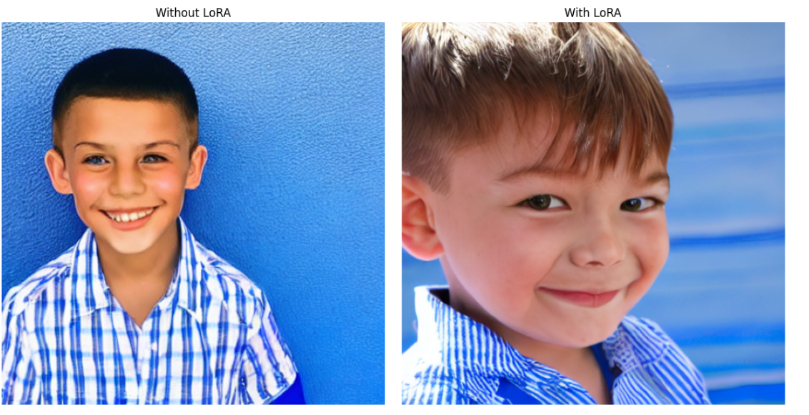
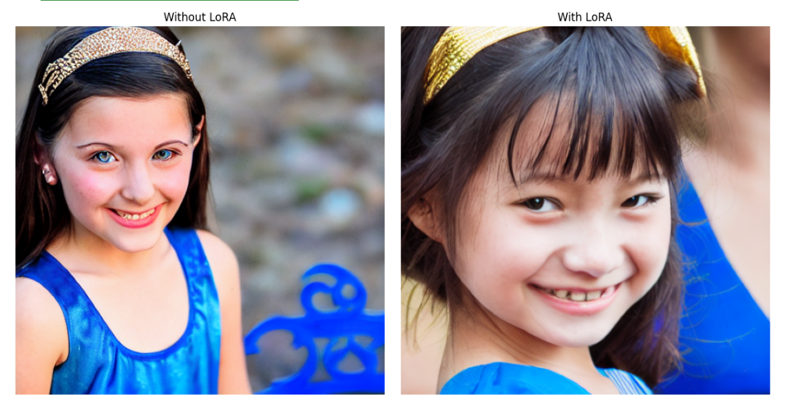
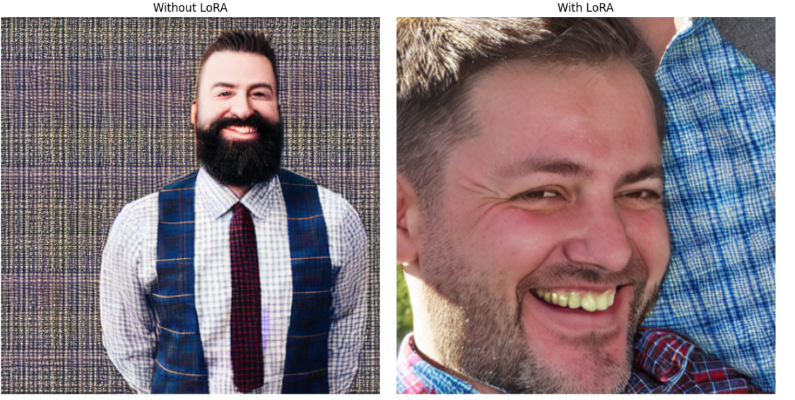
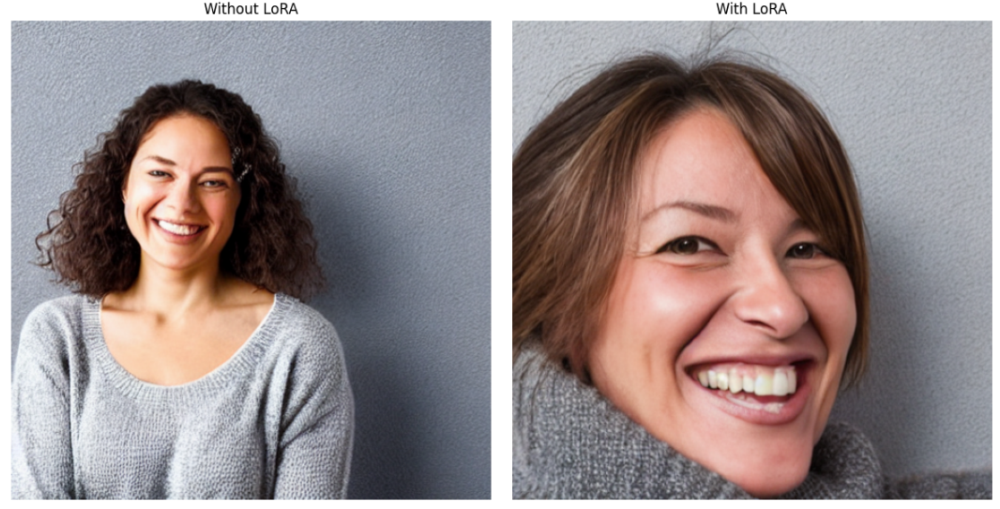
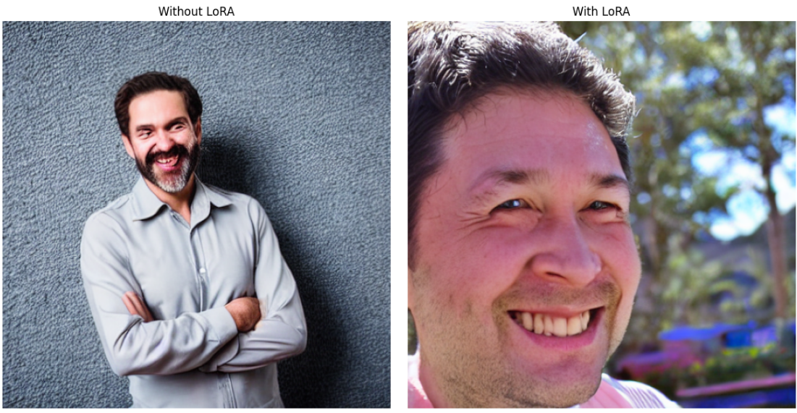

# 🧠 AI vs AI — Graduation Project (Helwan University)

**AI vs AI** is a dual-module system developed as our graduation project at the Faculty of Computers & Artificial Intelligence, Helwan University. The system bridges two cutting-edge areas of Artificial Intelligence:

- ✅ **Face Generation**: Synthesizing photorealistic human faces using Stable Diffusion v1.5 fine-tuned with LoRA.
- 🔍 **Face Detection**: Classifying uploaded faces as real or AI-generated using EfficientNet-B6.

---

## 📌 Project Objectives

> Enhance facial image synthesis realism and establish a robust pipeline for detecting AI-generated imagery.

This unified platform supports ethical media creation and combats synthetic content manipulation, making it highly relevant for journalism, marketing, content creation, and digital forensics.

---

## 🧬 Module 1: Photorealistic Face Generation

**👨‍💻 Developed by: Abdelrhman Khaled Hassan**

This module fine-tunes [Stable Diffusion v1.5](https://huggingface.co/runwayml/stable-diffusion-v1-5) using [LoRA (Low-Rank Adaptation)](https://arxiv.org/abs/2106.09685) to specialize in high-fidelity face generation.

### 🔹 Dataset: FFHQ (Flickr-Faces-HQ)
- 70,000 high-resolution 1024×1024 face images.
- No captions initially; descriptive captions were automatically generated using **LLaVA** (Large Language and Vision Assistant).
- ~52,000 captioned image-text pairs used for training.

### 🔧 Training Pipeline
- **Base model**: Stable Diffusion v1.5
- **Fine-tuning**: LoRA adapters via PEFT (Hugging Face)
- **Target layers**: attention, projection, and convolutional layers (`to_q`, `to_k`, `to_v`, `proj_in`, etc.)
- **Batch size**: 4 × 4 accumulation (effective 16)
- **Epochs**: 30
- **Learning rate**: 5e-5 (cosine scheduler with warmup)
- **Precision**: FP16 (mixed)
- **Environment**: Dual T4 GPUs on Kaggle

### 📈 Results & Highlights
- ✅ Vast improvements in facial realism, lighting, eye detail, and texture fidelity.
- ✅ Fewer artifacts and better symmetry compared to base SD1.5 and Canva AI.
- ✅ Outputs closely match real photos in visual quality.

📄 [Read Full Paper](docs/Enhancing%20Facial%20Realism%20Fine-tuning%20Stable%20Diffusion%20with%20L.pdf)

🧪 You can try the face generation model live on [Hugging Face Spaces](https://huggingface.co/spaces/abdelrhman145/SD1.5_realistic_faces) — note that it runs **without GPU**, so image generation might take some time.

---

## 🧪 Module 2: Real vs. AI Face Detection

**👨‍💻 Developed by: Omar Mohamed**

This classifier determines whether a face is **AI-generated** or **real**, using CNN-based architectures.

### 🏗 Architecture
- Model: **EfficientNet-B6**
- Task: Binary classification (AI vs. Real)
- Training split: 70% train, 15% val, 15% test
- Epochs: 2.5 | Batch Size: 16 | LR: 5e-5

### 📊 Datasets
Combined over 300K face images from:
- FFHQ (Real)
- StyleGAN, Stable Diffusion v1.4/v1.5/SDXL
- CelebA-HQ, EG3D, SFHQ, DALL·E, Midjourney

### 💡 Detection Approach
- Feature extraction (CNN)
- Cross-domain training
- Detection of subtle artifacts (texture, edge noise, lighting anomalies)
- Resilient to compression/resizing

---

## 🖥 Web Application

A full-stack web app for:
- 🎨 Prompt-based face generation
- 📤 Image upload for detection
- 📈 User dashboard, session handling
- 👤 Admin panel with stats and controls

📁 Technologies: Python (Flask), Angular, REST API, SQL Server

---

## 🧾 Repo Structure

```
AI-VS-AI-Project/
├── training_generation_model/
│   ├── train-sd1-5-lora-for-realistic-faces.ipynb
│   ├── ffhq-generate-description.ipynb  ← Auto-captioning via LLaVA
│   ├── pytorch_lora_weights.bin         ← LoRA weights
│   ├── adapter_config.json
│   └── test-generator.ipynb
├── web_app/
│   ├── AiVsAi/        ← Frontend (Angular)
│   ├── backend/       ← API + Auth (Flask)
│   └── GP.bak         ← SQL Server DB backup
├── docs/
│   ├── AI vs AI documentation.pdf
│   └── Enhancing Facial Realism...pdf
├── photos/            ← Visual output comparisons
└── README.md
```

---

## 📸 Before vs After: LoRA Fine-Tuning Examples

> Comparison between base Stable Diffusion vs LoRA-tuned outputs:







_(More results in `/photos`)_

---

## 🎥 Demo Video

[](https://youtu.be/F_p1eyBO_bM?si=NtgiyMTq59KdWVSd)

Covers:
- User flow for generation and detection
- Real-time output
- Comparison visuals
- UX/UI walkthrough

---

## 📄 Full Documentation

📘 [AI vs AI documentation.pdf](docs/AI%20vs%20AI%20documentation.pdf) — Full system design & implementation  
📑 [Research Paper](docs/Enhancing%20Facial%20Realism%20Fine-tuning%20Stable%20Diffusion%20with%20L.pdf) — In-depth face generation paper

---

## 👨‍💻 Contributors

| Name                     | Role                         |
|--------------------------|------------------------------|
| **Abdelrhman Khaled Hassan** | Face Generation & Research Lead |
| **Omar Mohamed**             | Detection Model Developer      |
| **Thanaa Khairy Sayed**      | System Design & Backend        |
| **Jawaher Ibrahim Ali**      | Frontend Developer             |
| **Rodina Yahia Mohamed**     | UX/UI Designer                 |
| **Mona Mohamed Abdel Aziz**  | Documentation & Testing        |

**Supervisor**: Dr. Mohammed El-Said  
📬 **Contact**: Abdelrhmannkhaledd00@gmail.com

---

## 🏷 Keywords & Tech Stack

`#StableDiffusion` `#LoRA` `#PEFT` `#LLaVA` `#FFHQ`  
`#EfficientNet` `#AIImageDetection` `#FaceGeneration` `#ComputerVision`  
`#GraduationProject` `#HelwanUniversity` `#DeepLearning`

---

> 🔍 For collaborations, inquiries, or contributions, feel free to open an issue or contact us directly.
